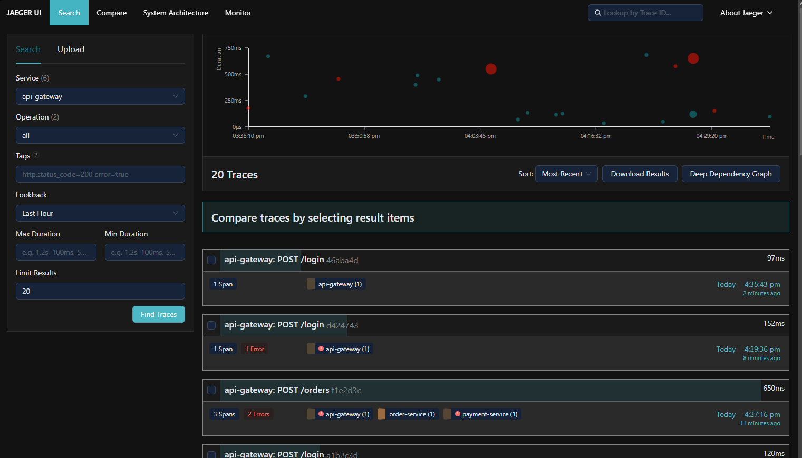
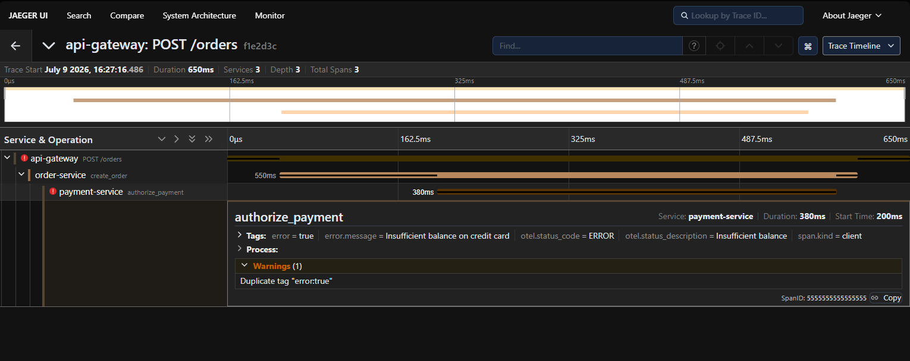

# horse-opentelemetry

Middleware de **OpenTelemetry** para o framework web **Horse**.

Este middleware fornece propagação de contexto distribuído e validação do padrão W3C Trace Context para APIs Delphi e Lazarus (FPC).

## 💡 Quando usar?

Você deve utilizar este middleware quando precisar de:
1. **Rastreamento Distribuído (Distributed Tracing)**: Acompanhar o fluxo de uma requisição que passa por múltiplos microsserviços ou APIs em sua infraestrutura.
2. **Correlação de Logs**: Associar logs de banco de dados, regras de negócio e erros ao mesmo `TraceID` gerado na requisição HTTP.
3. **Mapeamento de Performance (APM)**: Coletar tempos de resposta e associá-los a spans específicos para identificar gargalos e lentidões.
4. **Observabilidade**: Integrar suas APIs com coletores OpenTelemetry (como Jaeger, Zipkin, Prometheus, OpenTelemetry Collector, AWS X-Ray, etc.).

## ⚙️ Como funciona?

O middleware atua no ciclo de vida de cada requisição HTTP de forma automática:
1. **Validação**: Verifica se a requisição possui o cabeçalho `traceparent` de acordo com a especificação **W3C** (formato: `00-{traceid}-{spanid}-{traceflags}`).
2. **Propagação**: Se houver um `TraceID` válido no cabeçalho, ele propaga esse ID para manter a correlação da chamada externa. Caso contrário, gera um novo `TraceID` exclusivo para esta requisição.
3. **Identificação Local**: Gera um `SpanID` exclusivo para a etapa atual de processamento na API.
4. **Injeção de Cabeçalho**: Adiciona o cabeçalho `traceparent` na resposta HTTP para que o cliente ou o próximo microsserviço da cadeia consiga ler e propagar o contexto.
5. **Ciclo de Vida Limpo**: Cria o objeto `THorseOpenTelemetryContext` e o armazena no `Req.State`. O middleware garante a liberação deste objeto da memória ao final do ciclo de processamento da requisição, prevenindo qualquer tipo de vazamento de memória (Memory Leak).

## 🚀 Instalação

### Via Boss Package Manager
A forma recomendada de instalação é através do gerenciador de pacotes [Boss](https://github.com/HashLoad/boss):
```sh
boss install horse-opentelemetry
```

### Instalação Manual
Caso prefira, basta clonar este repositório e adicionar o caminho da pasta raiz do projeto no **Search Path** da sua IDE (Delphi ou Lazarus).

## 💻 Compatibilidade

Este middleware é 100% compatível com:
* **Delphi XE7 ou superior** (Win32, Win64, Linux, etc.)
* **Lazarus / FPC** (modo de sintaxe Delphi)

---

## ⚡ Exemplo Prático de Uso

### Delphi (Usando métodos anônimos)
```delphi
uses
  Horse,
  Horse.OpenTelemetry;

begin
  // Registrar o middleware do OpenTelemetry
  THorse.Use(THorseOpenTelemetry.Middleware);

  THorse.Get('/ping',
    procedure(Req: THorseRequest; Res: THorseResponse; Next: TProc)
    var
      LOtelCtx: THorseOpenTelemetryContext;
    begin
      // Recuperar o contexto do OTel a partir do Req.State
      LOtelCtx := THorseOpenTelemetryContext(Req.State.Items['otel.context']);
      
      // Exemplo de uso dos IDs nos logs ou em chamadas HTTP externas subsequentes
      Writeln('TraceID da Requisição: ', LOtelCtx.TraceId);
      Writeln('SpanID desta Execução: ', LOtelCtx.SpanId);

      Res.Send('pong');
    end);

  THorse.Listen(9000);
end.
```

### Lazarus / FPC (Usando procedimentos convencionais)
```delphi
program Server;

{$MODE DELPHI}{$H+}

uses
  SysUtils, Horse, Horse.OpenTelemetry;

procedure GetPing(Req: THorseRequest; Res: THorseResponse; Next: TNextProc);
var
  LOtelCtx: THorseOpenTelemetryContext;
begin
  LOtelCtx := THorseOpenTelemetryContext(Req.State.Items['otel.context']);
  
  Writeln('TraceID da Requisição: ', LOtelCtx.TraceId);
  Writeln('SpanID desta Execução: ', LOtelCtx.SpanId);

  Res.Send('pong');
end;

begin
  THorse.Use(THorseOpenTelemetry.Middleware);
  THorse.Get('/ping', GetPing);
  THorse.Listen(9000);
end.
```

---

## 🐳 Como Configurar o Servidor OpenTelemetry (Jaeger)

Para receber e visualizar graficamente os dados de rastreamento das suas requisições, o projeto já inclui arquivos de configuração Docker prontos na pasta [docker/](file:///d:/Delphi/horse-opentelemetry/docker/).

### Opção A: Setup Rápido (Apenas Jaeger - Recomendado)
Ideal para desenvolvimento local, onde o próprio Jaeger atua como coletor OTLP recebendo diretamente as requisições:
1. Abra o terminal e navegue até a pasta `docker/` do projeto.
2. Execute o comando:
   ```bash
   docker compose up -d
   ```

### Opção B: Stack Completa (OTel Collector + Jaeger)
Simula uma infraestrutura de produção completa com o coletor oficial do OpenTelemetry recebendo os dados das APIs e exportando-os para o Jaeger:
1. Abra o terminal e navegue até a pasta `docker/` do projeto.
2. Execute o comando:
   ```bash
   docker compose -f docker-compose-complete.yml up -d
   ```
Após iniciar qualquer uma das opções, acesse a interface gráfica de visualização no seu navegador:
👉 **[http://localhost:16686](http://localhost:16686)**

### 📝 Comandos Úteis do Docker

Navegue até a pasta `docker/` e utilize os comandos abaixo para gerenciar a stack:

* **Visualizar os logs em tempo real**:
  ```bash
  # Para a Opção A
  docker compose logs -f

  # Para a Opção B
  docker compose -f docker-compose-complete.yml logs -f
  ```
* **Parar os serviços**:
  ```bash
  # Para a Opção A
  docker compose down

  # Para a Opção B
  docker compose -f docker-compose-complete.yml down
  ```
* **Verificar o status dos containers**:
  ```bash
  # Para a Opção A
  docker compose ps

  # Para a Opção B
  docker compose -f docker-compose-complete.yml ps
  ```

---

## 🧪 Como Testar o Ambiente

O projeto possui exemplos de servidores prontos e uma suíte completa de testes unitários para você validar a configuração.

### 1. Testes Unitários Locais
Você pode rodar a suíte de testes unitários para validar se os algoritmos de geração de hexadecimais, parsing e alocação do contexto estão funcionando perfeitamente em sua máquina:
1. Abra o PowerShell e navegue até a pasta `tests/`.
2. Execute o script de automação de testes:
   ```powershell
   cd tests
   .\run_tests.ps1
   ```
   *O script tentará compilar e executar a suíte de testes unitários no Delphi (via dcc32) e no Lazarus (via fpc.exe) caso eles estejam configurados no seu ambiente.*

### 2. Testes de Fluxo na API (End-to-End)
Você pode rodar os servidores de teste localizados na pasta `samples/` e validar o comportamento usando a ferramenta `curl` do terminal:

#### Cenário A: Nova requisição (Geração de Contexto)
Envie uma requisição simples sem cabeçalhos de rastreamento:
```bash
curl -i http://localhost:9000/ping
```
* **Comportamento Esperado**: O terminal do servidor mostrará um novo `TraceID` e `SpanID` gerados. Nos cabeçalhos da resposta HTTP, você verá o cabeçalho `traceparent` injetado (ex: `traceparent: 00-{TraceID_Novo}-{SpanID_Novo}-01`).

#### Cenário B: Propagação de Contexto (Distributed Tracing)
Envie uma requisição simulando a continuação de um rastreamento iniciado por outra aplicação, injetando o cabeçalho `traceparent` no formato W3C:
```bash
curl -i -H "traceparent: 00-4bf92f3577b34da6a3ce929d0e0e4736-00f067aa0ba902b7-01" http://localhost:9000/ping
```
* **Comportamento Esperado**: O console do servidor exibirá:
  * **TraceID**: `4bf92f3577b34da6a3ce929d0e0e4736` (exatamente o mesmo do cabeçalho enviado, mantendo a correlação).
  * **Parent SpanID**: `00f067aa0ba902b7` (o SpanID que originou a requisição).
  * **SpanID**: Um novo ID gerado unicamente para esta execução local.
* **Headers de Resposta**: O cabeçalho `traceparent` retornado na resposta HTTP propagará o mesmo `TraceID` associado ao novo `SpanID` gerado localmente.

---

## 📊 Visualização no Jaeger Dashboard

O ecossistema OpenTelemetry permite analisar os rastreamentos e dependências de forma muito rica e detalhada. Abaixo estão explicadas as duas principais telas de observabilidade disponíveis no Jaeger ao testar este projeto:

### 1. Painel de Busca e Linha de Tempo (Search & Timeline)
Esta tela oferece uma visão geral do tráfego na API, agrupando as requisições por serviço, rota e horário.



* **Gráfico de Dispersão (Top)**: Cada círculo representa uma requisição executada. Bolinhas verdes representam requisições com sucesso e vermelhas sinalizam erros de execução. O tamanho da bolinha é proporcional ao tempo de duração da requisição.
* **Lista de Traces (Bottom)**: Mostra os detalhes de cada transação, como a rota (`POST /login` ou `POST /orders`), o tempo total de processamento, e quais micro-serviços foram acionados naquela chamada (ex: `api-gateway`, `order-service` e `payment-service` envolvidos em uma única transação).

---

### 2. Rastreamento Distribuído Detalhado (Trace Detail)
Ao clicar em uma transação, é exibida a árvore hierárquica (gráfico de Gantt) do ciclo de vida da requisição.



* **Cascata de Execução (Timeline)**: Exibe a ordem sequencial e o tempo gasto em cada serviço. Na imagem acima, a chamada `POST /orders` (no `api-gateway`) disparou a criação do pedido (`order-service`), que por sua vez disparou a autorização de pagamento (`payment-service`).
* **Tags de Metadados e Erros**: Ao expandir um Span com falha, o Jaeger mostra os detalhes do erro de forma automatizada (como `error = true` e `error.message = Insufficient balance on credit card`), facilitando a depuração e diagnóstico rápido de falhas sem precisar vasculhar arquivos de logs massivos.
